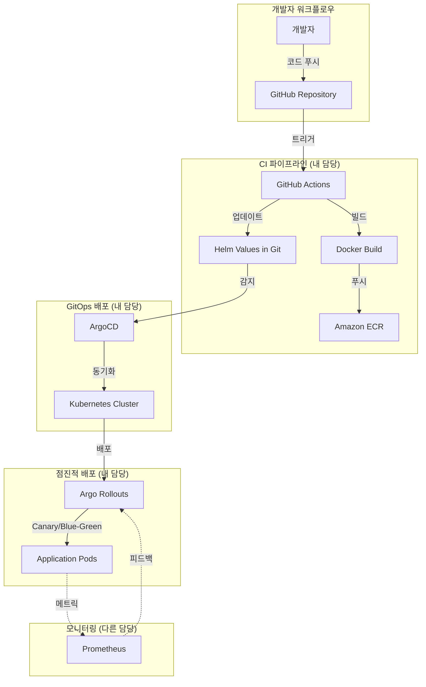

# 설계 문서

## TL;DR - 핵심 요약

**무엇을 만드는가?**
서버리스 플랫폼의 CI/CD 및 GitOps 파이프라인 (인프라 담당)

**내 역할:**
- GitHub Actions 워크플로우 작성
- Docker 이미지 빌드 및 ECR 푸시 자동화
- Helm 차트 작성 (플랫폼 서비스 + 사용자 함수)
- ArgoCD 설정 (GitOps 자동 배포)
- Argo Rollouts 설정 (Canary/Blue-Green)
- 환경별 배포 전략 (dev/staging/prod)

**핵심 흐름:**
```
코드 푸시 → GitHub Actions 빌드 → ECR 푸시 
→ Helm values 업데이트 → Git 커밋 
→ ArgoCD 감지 → K8s 배포 
→ Argo Rollouts (20% → 50% → 80% → 100%)
```

**기술 스택:**
- CI: GitHub Actions
- 컨테이너: Docker + Amazon ECR
- 패키징: Helm Charts
- 배포: ArgoCD (GitOps)
- 점진적 배포: Argo Rollouts
- 인프라: Kubernetes

**범위 밖:**
- ❌ Prometheus/Grafana 메트릭 정의 (모니터링 담당)
- ❌ Frontend/Backend/Worker 애플리케이션 로직 (각 팀 담당)
- ❌ Redis Queue, 함수 실행 엔진 (Backend/Worker 팀)

## 개요

본 시스템은 서버리스 플랫폼의 CI/CD 및 GitOps 파이프라인입니다. 모든 서비스(Frontend, Backend, Worker)와 사용자 함수가 자동으로 빌드, 패키징, 배포됩니다.

**설계 원칙:**
- **자동화 우선**: 코드 푸시부터 배포까지 수동 개입 없음
- **GitOps 기반**: Git을 단일 진실 공급원으로 사용
- **안전한 배포**: 점진적 배포로 프로덕션 안정성 보장
- **재사용성**: Helm 템플릿으로 일관된 배포 패턴 적용

## 아키텍처



## 컴포넌트 및 인터페이스

### 1. GitHub Actions 워크플로우

**책임:**
- 코드 변경 감지 및 CI 파이프라인 실행
- Docker 이미지 빌드 및 ECR 푸시
- Helm values 파일 자동 업데이트

**워크플로우 구조:**

```yaml
# .github/workflows/ci-cd.yml
name: CI/CD Pipeline

on:
  push:
    branches: [main, develop]
    paths:
      - 'services/**'
      - '.github/workflows/**'

env:
  AWS_REGION: us-east-1
  ECR_REGISTRY: 123456789.dkr.ecr.us-east-1.amazonaws.com

jobs:
  build-and-deploy:
    runs-on: ubuntu-latest
    strategy:
      matrix:
        service: [frontend, backend, worker]
    
    steps:
      - name: Checkout code
        uses: actions/checkout@v4
      
      - name: Configure AWS credentials
        uses: aws-actions/configure-aws-credentials@v4
        with:
          role-to-assume: ${{ secrets.AWS_ROLE_ARN }}
          aws-region: ${{ env.AWS_REGION }}
      
      - name: Login to ECR
        uses: aws-actions/amazon-ecr-login@v2
      
      - name: Build Docker image
        run: |
          cd services/${{ matrix.service }}
          docker build -t ${{ env.ECR_REGISTRY }}/${{ matrix.service }}:${{ github.sha }} .
      
      - name: Push to ECR
        run: |
          docker push ${{ env.ECR_REGISTRY }}/${{ matrix.service }}:${{ github.sha }}
      
      - name: Update Helm values
        run: |
          cd helm/values
          yq eval ".image.tag = \"${{ github.sha }}\"" -i values-${{ matrix.service }}.yaml
      
      - name: Commit and push
        run: |
          git config user.name "GitHub Actions"
          git config user.email "actions@github.com"
          git add helm/values/values-${{ matrix.service }}.yaml
          git commit -m "Update ${{ matrix.service }} image to ${{ github.sha }}"
          git push
```

**주요 기능:**
- 멀티 서비스 병렬 빌드 (matrix strategy)
- AWS OIDC 인증 (IAM Role 사용)
- ECR 자동 로그인 및 푸시
- Helm values 자동 업데이트 및 Git 커밋

### 2. Dockerfile 구조

**책임:**
- 각 서비스별 최적화된 컨테이너 이미지 생성
- 멀티 스테이지 빌드로 이미지 크기 최소화

**Backend Dockerfile:**
```dockerfile
FROM python:3.11-slim AS builder

WORKDIR /app

COPY requirements.txt .
RUN pip install --no-cache-dir --user -r requirements.txt

FROM python:3.11-slim

WORKDIR /app

COPY --from=builder /root/.local /root/.local
COPY . .

ENV PATH=/root/.local/bin:$PATH

RUN useradd -m -u 1000 appuser && chown -R appuser:appuser /app
USER appuser

EXPOSE 8000

CMD ["uvicorn", "main:app", "--host", "0.0.0.0", "--port", "8000"]
```

**Frontend Dockerfile:**
```dockerfile
FROM node:18-alpine AS builder

WORKDIR /app

COPY package*.json ./
RUN npm ci

COPY . .
RUN npm run build

FROM nginx:alpine

COPY --from=builder /app/dist /usr/share/nginx/html
COPY nginx.conf /etc/nginx/nginx.conf

EXPOSE 80

CMD ["nginx", "-g", "daemon off;"]
```

### 3. Helm 차트 구조

**책임:**
- 쿠버네티스 리소스 템플릿 관리
- 환경별 설정 분리

**디렉토리 구조:**
```
helm/
├── charts/
│   ├── platform-service/          # 공통 차트 (Frontend/Backend/Worker)
│   │   ├── Chart.yaml
│   │   ├── values.yaml
│   │   └── templates/
│   │       ├── deployment.yaml
│   │       ├── service.yaml
│   │       ├── ingress.yaml
│   │       └── rollout.yaml
│   │
│   └── user-function/             # 사용자 함수 차트
│       ├── Chart.yaml
│       ├── values.yaml
│       └── templates/
│           ├── deployment.yaml
│           ├── service.yaml
│           └── hpa.yaml
│
└── values/
    ├── values-frontend-dev.yaml
    ├── values-frontend-staging.yaml
    ├── values-frontend-prod.yaml
    ├── values-backend-dev.yaml
    ├── values-backend-staging.yaml
    ├── values-backend-prod.yaml
    ├── values-worker-dev.yaml
    ├── values-worker-staging.yaml
    └── values-worker-prod.yaml
```

**플랫폼 서비스 values 예시:**
```yaml
# values-backend-prod.yaml
service:
  name: backend
  type: ClusterIP
  port: 8000

image:
  repository: 123456789.dkr.ecr.us-east-1.amazonaws.com/backend
  tag: abc123def  # GitHub Actions가 자동 업데이트
  pullPolicy: IfNotPresent

replicaCount: 3

resources:
  limits:
    cpu: 2000m
    memory: 2Gi
  requests:
    cpu: 1000m
    memory: 1Gi

ingress:
  enabled: true
  className: nginx
  annotations:
    cert-manager.io/cluster-issuer: letsencrypt-prod
  hosts:
    - host: api.serverless.example.com
      paths:
        - path: /
          pathType: Prefix
  tls:
    - secretName: backend-tls
      hosts:
        - api.serverless.example.com

autoscaling:
  enabled: true
  minReplicas: 3
  maxReplicas: 20
  targetCPUUtilizationPercentage: 70

rollout:
  enabled: true
  strategy: blueGreen  # production은 Blue-Green
```

**Rollout 템플릿:**
```yaml
# templates/rollout.yaml
{{- if .Values.rollout.enabled }}
apiVersion: argoproj.io/v1alpha1
kind: Rollout
metadata:
  name: {{ .Values.service.name }}
spec:
  replicas: {{ .Values.replicaCount }}
  strategy:
    {{- if eq .Values.rollout.strategy "canary" }}
    canary:
      steps:
        - setWeight: 20
        - pause: {duration: 2m}
        - setWeight: 50
        - pause: {duration: 2m}
        - setWeight: 80
        - pause: {duration: 2m}
      canaryService: {{ .Values.service.name }}-canary
      stableService: {{ .Values.service.name }}-stable
    {{- else if eq .Values.rollout.strategy "blueGreen" }}
    blueGreen:
      activeService: {{ .Values.service.name }}
      previewService: {{ .Values.service.name }}-preview
      autoPromotionEnabled: false
    {{- end }}
  selector:
    matchLabels:
      app: {{ .Values.service.name }}
  template:
    metadata:
      labels:
        app: {{ .Values.service.name }}
    spec:
      containers:
        - name: {{ .Values.service.name }}
          image: {{ .Values.image.repository }}:{{ .Values.image.tag }}
          ports:
            - containerPort: {{ .Values.service.port }}
          resources:
            {{- toYaml .Values.resources | nindent 12 }}
{{- end }}
```

### 4. ArgoCD 설정

**책임:**
- Git 저장소 모니터링
- 쿠버네티스 클러스터 동기화
- 배포 상태 추적

**App-of-Apps 패턴:**
```yaml
# argocd/root-app.yaml
apiVersion: argoproj.io/v1alpha1
kind: Application
metadata:
  name: serverless-platform
  namespace: argocd
spec:
  project: default
  source:
    repoURL: https://github.com/team/serverless-platform
    targetRevision: main
    path: argocd/applications
  destination:
    server: https://kubernetes.default.svc
    namespace: argocd
  syncPolicy:
    automated:
      prune: true
      selfHeal: true
```

**개별 서비스 Application:**
```yaml
# argocd/applications/backend-prod.yaml
apiVersion: argoproj.io/v1alpha1
kind: Application
metadata:
  name: backend-prod
  namespace: argocd
spec:
  project: default
  source:
    repoURL: https://github.com/team/serverless-platform
    targetRevision: main
    path: helm/charts/platform-service
    helm:
      valueFiles:
        - ../../values/values-backend-prod.yaml
  destination:
    server: https://kubernetes.default.svc
    namespace: production
  syncPolicy:
    automated:
      prune: true
      selfHeal: true
    syncOptions:
      - CreateNamespace=true
    retry:
      limit: 5
      backoff:
        duration: 5s
        factor: 2
        maxDuration: 3m
```

### 5. 환경별 배포 전략

**dev 환경:**
```yaml
# values-backend-dev.yaml
rollout:
  enabled: false  # dev는 일반 Deployment 사용

autoscaling:
  enabled: false

replicaCount: 1

resources:
  limits:
    cpu: 500m
    memory: 512Mi
  requests:
    cpu: 250m
    memory: 256Mi
```

**staging 환경:**
```yaml
# values-backend-staging.yaml
rollout:
  enabled: true
  strategy: canary  # staging은 Canary

replicaCount: 2

resources:
  limits:
    cpu: 1000m
    memory: 1Gi
  requests:
    cpu: 500m
    memory: 512Mi
```

**production 환경:**
```yaml
# values-backend-prod.yaml
rollout:
  enabled: true
  strategy: blueGreen  # production은 Blue-Green

replicaCount: 3

resources:
  limits:
    cpu: 2000m
    memory: 2Gi
  requests:
    cpu: 1000m
    memory: 1Gi
```

## 데이터 모델

### 1. 이미지 태그 형식

```yaml
# 이미지 태그 구조
tag: <git-sha>

# 예시
tag: abc123def456789  # Git 커밋 해시 (짧은 형식)

# 태그 생성 로직
generate_tag():
  return git_commit_sha[:15]
```

### 2. Helm Values 스키마

```yaml
# 공통 values 스키마
service:
  name: string          # 서비스 이름
  type: string          # ClusterIP | NodePort | LoadBalancer
  port: integer         # 서비스 포트

image:
  repository: string    # ECR 저장소 URL
  tag: string          # 이미지 태그 (git-sha)
  pullPolicy: string   # Always | IfNotPresent | Never

replicaCount: integer  # 파드 복제본 수

resources:
  limits:
    cpu: string        # CPU 제한
    memory: string     # 메모리 제한
  requests:
    cpu: string        # CPU 요청
    memory: string     # 메모리 요청

rollout:
  enabled: boolean     # Rollout 사용 여부
  strategy: string     # canary | blueGreen

autoscaling:
  enabled: boolean
  minReplicas: integer
  maxReplicas: integer
  targetCPUUtilizationPercentage: integer

ingress:
  enabled: boolean
  className: string
  hosts: array
  tls: array
```

## 정확성 속성

*속성(Property)은 시스템의 모든 유효한 실행에서 참이어야 하는 특성 또는 동작입니다.*

### 속성 1: 이미지 태그 고유성

*모든* Git 커밋에 대해, 생성된 이미지 태그는 해당 커밋 해시를 포함하며 고유해야 합니다.

**검증: 요구사항 1.3, 8.1**

### 속성 2: Helm values 업데이트 일관성

*모든* 이미지 태그 업데이트에 대해, Helm values 파일을 업데이트한 후 파일을 파싱하면 새로운 이미지 태그가 정확히 반영되어 있어야 합니다.

**검증: 요구사항 1.4**

### 속성 3: 환경별 values 파일 격리

*모든* 환경(dev, staging, production)에 대해, 한 환경의 values 파일을 수정해도 다른 환경의 values 파일은 변경되지 않아야 합니다.

**검증: 요구사항 5.5**

### 속성 4: Helm 템플릿 렌더링 유효성

*모든* 유효한 Helm values에 대해, 템플릿을 렌더링한 결과는 유효한 YAML 형식의 쿠버네티스 매니페스트여야 합니다.

**검증: 요구사항 7.3**

### 속성 5: 이미지 태그 결정성

*모든* Git 커밋 해시에 대해, 동일한 커밋에서 여러 번 태그를 생성하면 항상 동일한 태그가 생성되어야 합니다.

**검증: 요구사항 8.2**

### 속성 6: Rollout 전략 일관성

*모든* 환경 설정에 대해, staging 환경은 Canary 전략을, production 환경은 Blue-Green 전략을 사용해야 합니다.

**검증: 요구사항 5.3, 5.4**

## 에러 처리

### 1. 빌드 실패 처리

**시나리오:**
- Docker 빌드 실패
- ECR 인증 실패
- ECR 푸시 실패

**처리 전략:**
- 모든 에러는 구조화된 로그로 기록
- GitHub Actions 워크플로우는 즉시 실패 상태로 전환
- 재시도 가능한 에러(네트워크 타임아웃)는 최대 3회 재시도

**에러 로그 형식:**
```json
{
  "timestamp": "2024-01-15T10:30:00Z",
  "level": "error",
  "component": "docker-build",
  "service": "backend",
  "error": {
    "type": "BuildError",
    "message": "Failed to build image",
    "details": "...",
    "exitCode": 1
  },
  "context": {
    "gitCommit": "abc123",
    "branch": "main"
  }
}
```

### 2. Helm Values 업데이트 실패

**시나리오:**
- YAML 파싱 에러
- Git 커밋 실패
- Git 푸시 실패 (권한 또는 충돌)

**처리 전략:**
- YAML 유효성 검증 후 업데이트
- Git 충돌 발생 시 자동 pull 및 재시도
- 최대 3회 재시도 후 실패

### 3. ArgoCD 동기화 실패

**시나리오:**
- 잘못된 Helm values
- 쿠버네티스 리소스 생성 실패
- 네임스페이스 권한 부족

**처리 전략:**
- ArgoCD 자동 재시도 (최대 5회)
- 실패 시 이전 상태 유지
- Slack 알림 발송

## 테스트 전략

### 1. Helm 차트 검증

**도구:** helm lint, kubeval

**테스트:**
```bash
# Helm 문법 검증
helm lint helm/charts/platform-service

# 쿠버네티스 스키마 검증
helm template backend helm/charts/platform-service \
  -f helm/values/values-backend-prod.yaml | \
  kubeval --strict
```

### 2. GitHub Actions 로컬 테스트

**도구:** act

**테스트:**
```bash
# 로컬에서 워크플로우 실행
act push -j build-and-deploy \
  --matrix service:backend \
  --secret-file .secrets
```

### 3. ArgoCD Dry-run

**테스트:**
```bash
# 동기화 시뮬레이션
argocd app sync backend-prod --dry-run

# Diff 확인
argocd app diff backend-prod
```

### 4. 속성 기반 테스트

**도구:** Python + Hypothesis

**테스트 대상:**
- 속성 1: 이미지 태그 고유성
- 속성 2: Helm values 업데이트 일관성
- 속성 3: 환경별 values 파일 격리
- 속성 4: Helm 템플릿 렌더링 유효성
- 속성 5: 이미지 태그 결정성
- 속성 6: Rollout 전략 일관성

**각 속성 기반 테스트는 최소 100회 반복 실행됩니다.**

**예시:**
```python
from hypothesis import given, strategies as st
import yaml

# Feature: serverless-cicd-pipeline, Property 1: 이미지 태그 고유성
@given(git_sha=st.text(min_size=40, max_size=40, alphabet='0123456789abcdef'))
@settings(max_examples=100)
def test_image_tag_uniqueness(git_sha):
    """모든 Git 커밋에 대해 이미지 태그가 고유해야 함"""
    tag1 = generate_image_tag(git_sha)
    tag2 = generate_image_tag(git_sha)
    
    # 동일한 커밋에 대해서는 동일한 태그
    assert tag1 == tag2
    assert tag1 == git_sha[:15]

# Feature: serverless-cicd-pipeline, Property 2: Helm values 업데이트 일관성
@given(
    image_tag=st.text(min_size=15, max_size=15, alphabet='0123456789abcdef'),
    service=st.sampled_from(['frontend', 'backend', 'worker'])
)
@settings(max_examples=100)
def test_helm_values_update_consistency(image_tag, service):
    """Helm values 업데이트 후 파싱하면 새 태그가 정확히 반영되어야 함"""
    values_file = f"helm/values/values-{service}-prod.yaml"
    
    # 업데이트
    update_helm_values(values_file, image_tag)
    
    # 검증
    with open(values_file) as f:
        values = yaml.safe_load(f)
    
    assert values['image']['tag'] == image_tag
```

## 보안 고려사항

### 1. AWS 인증

**OIDC 기반 인증:**
```yaml
# GitHub Actions에서 AWS 인증
- name: Configure AWS credentials
  uses: aws-actions/configure-aws-credentials@v4
  with:
    role-to-assume: arn:aws:iam::123456789:role/GitHubActionsRole
    aws-region: us-east-1
```

**IAM Role 정책:**
```json
{
  "Version": "2012-10-17",
  "Statement": [
    {
      "Effect": "Allow",
      "Action": [
        "ecr:GetAuthorizationToken",
        "ecr:BatchCheckLayerAvailability",
        "ecr:PutImage",
        "ecr:InitiateLayerUpload",
        "ecr:UploadLayerPart",
        "ecr:CompleteLayerUpload"
      ],
      "Resource": "*"
    }
  ]
}
```

### 2. 컨테이너 보안

- **Non-root 사용자**: 모든 컨테이너는 non-root로 실행
- **읽기 전용 파일시스템**: 가능한 경우 readOnlyRootFilesystem 사용
- **최소 권한**: 필요한 권한만 부여

### 3. Helm 차트 보안

- **시크릿 관리**: Sealed Secrets 또는 External Secrets Operator 사용
- **RBAC**: 최소 권한 원칙으로 ServiceAccount 설정

## 운영 가이드

### 1. 새 서비스 추가

```bash
# 1. Dockerfile 작성
mkdir -p services/new-service
cd services/new-service
# Dockerfile 작성

# 2. Helm values 생성
cp helm/values/values-backend-prod.yaml \
   helm/values/values-new-service-prod.yaml
# values 수정

# 3. ArgoCD Application 생성
cp argocd/applications/backend-prod.yaml \
   argocd/applications/new-service-prod.yaml
# Application 수정

# 4. GitHub Actions matrix에 추가
# .github/workflows/ci-cd.yml 수정
# matrix.service에 'new-service' 추가
```

### 2. 환경 추가

```bash
# 1. values 파일 생성
cp helm/values/values-backend-prod.yaml \
   helm/values/values-backend-test.yaml

# 2. ArgoCD Application 생성
cp argocd/applications/backend-prod.yaml \
   argocd/applications/backend-test.yaml

# 3. 네임스페이스 생성
kubectl create namespace test
```

### 3. 수동 롤백

```bash
# ArgoCD를 통한 롤백
argocd app rollback backend-prod

# 또는 Helm values 수정
cd helm/values
git revert HEAD  # 이전 커밋으로 되돌리기
git push
# ArgoCD가 자동으로 감지하고 배포
```

## 확장성 고려사항

### 다중 클러스터 지원

**ApplicationSet 사용:**
```yaml
apiVersion: argoproj.io/v1alpha1
kind: ApplicationSet
metadata:
  name: backend-multi-cluster
spec:
  generators:
    - list:
        elements:
          - cluster: us-east-1
            url: https://k8s-us-east-1.example.com
          - cluster: eu-west-1
            url: https://k8s-eu-west-1.example.com
  template:
    metadata:
      name: 'backend-{{cluster}}'
    spec:
      source:
        repoURL: https://github.com/team/serverless-platform
        path: helm/charts/platform-service
        helm:
          valueFiles:
            - ../../values/values-backend-prod.yaml
      destination:
        server: '{{url}}'
        namespace: production
```

### 모니터링 연동 (다른 담당자와 협업)

**Argo Rollouts AnalysisTemplate:**
```yaml
apiVersion: argoproj.io/v1alpha1
kind: AnalysisTemplate
metadata:
  name: success-rate
spec:
  metrics:
    - name: success-rate
      interval: 1m
      successCondition: result >= 0.95
      failureLimit: 3
      provider:
        prometheus:
          address: http://prometheus:9090  # 모니터링 담당자가 설정
          query: |
            sum(rate(http_requests_total{status=~"2.."}[5m])) /
            sum(rate(http_requests_total[5m]))
```

**참고:** Prometheus 쿼리와 메트릭 정의는 모니터링 담당자가 작성합니다.
