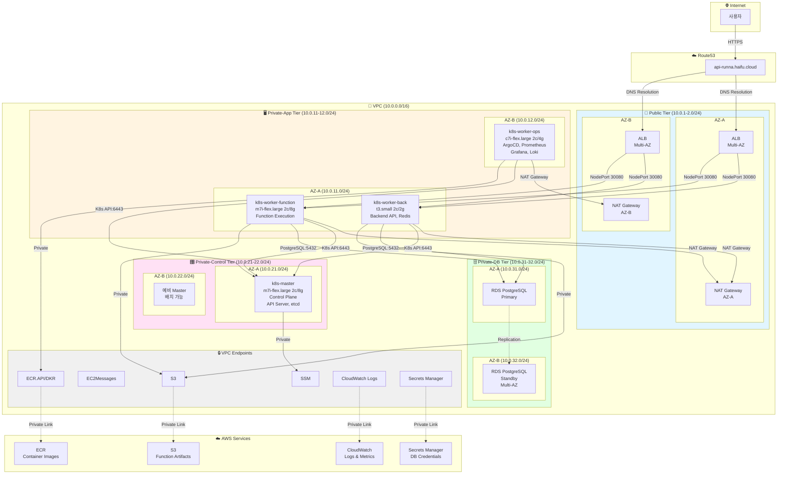
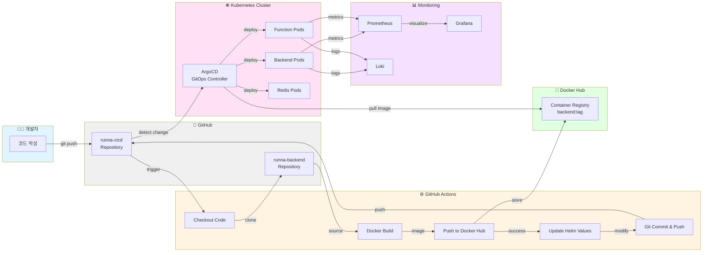
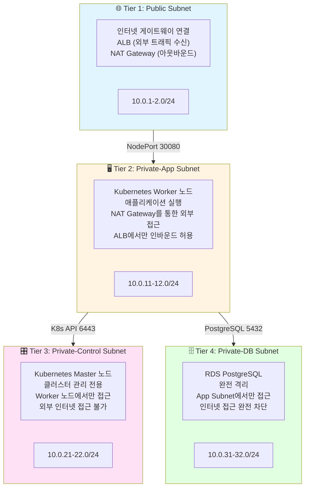
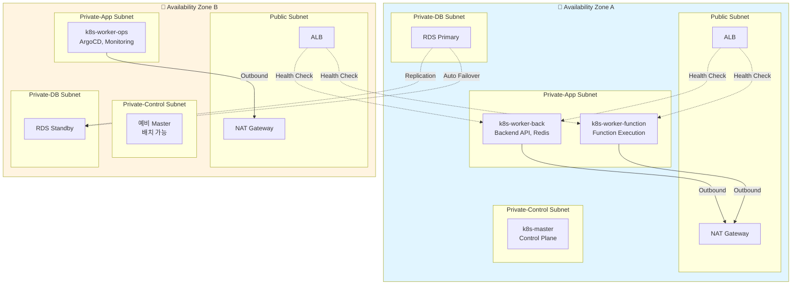
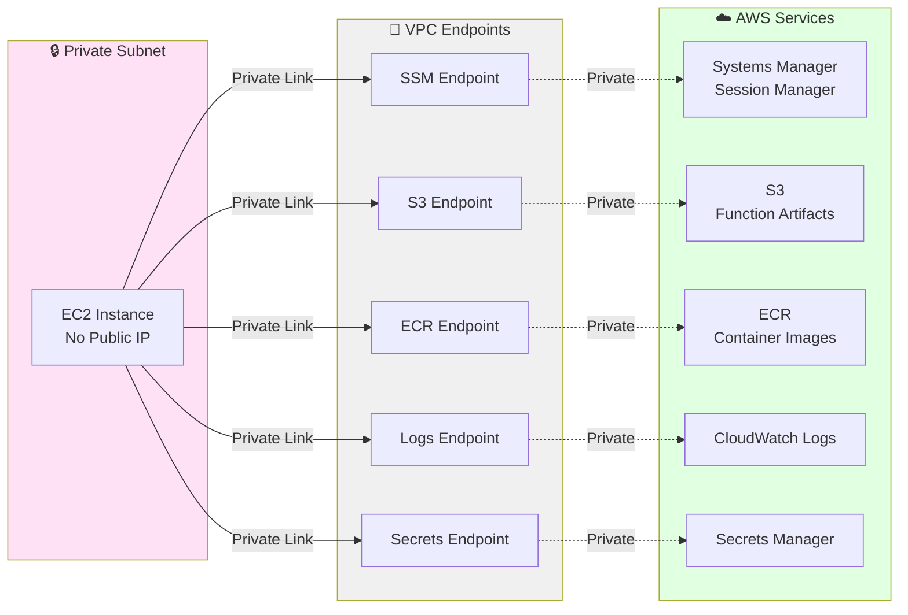
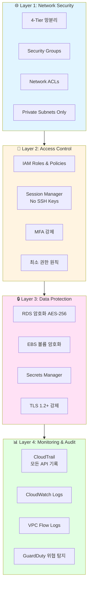
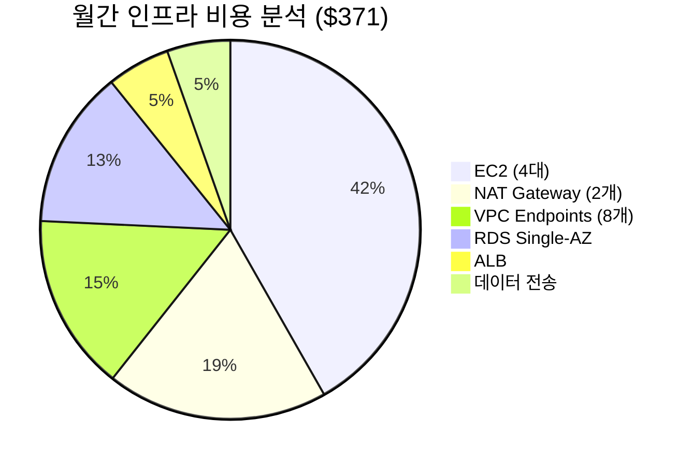
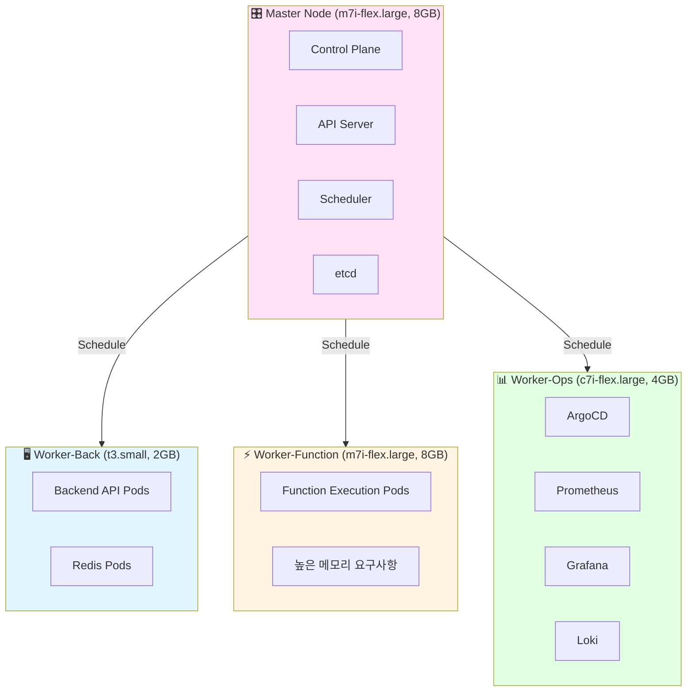
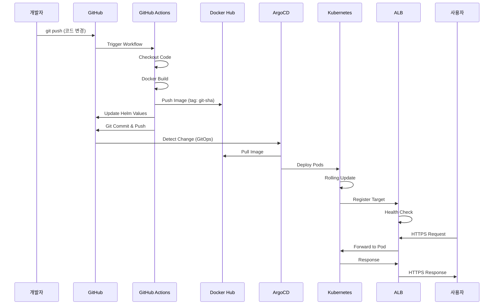

# Runna AWS Infrastructure Architecture Diagram

## 전체 시스템 아키텍처

## CI/CD 파이프라인 통합 아키텍처

## 4-Tier 망분리 보안 아키텍처

## Multi-AZ 고가용성 전략

## VPC Endpoint Private 통신

## 보안 계층 구조

## 비용 구조 분석

## 워크로드 배치 전략

## 배포 흐름도

## 장애 복구 시나리오

```mermaid
graph TB
    subgraph Scenario1["🔴 시나리오 1: AZ-A 장애"]
        S1_1[AZ-A 전체 장애 발생]
        S1_2[RDS Auto Failover<br/>AZ-B로 전환 1-2분]
        S1_3[ALB 자동 라우팅<br/>AZ-B로 트래픽 전환]
        S1_4[Worker 노드 재배치<br/>Kubernetes 자동 처리]
        S1_5[서비스 정상화<br/>다운타임 최소화]
    end
    
    subgraph Scenario2["🟡 시나리오 2: 인스턴스 장애"]
        S2_1[Worker 노드 장애 감지]
        S2_2[새 인스턴스 생성]
        S2_3[K3s Join]
        S2_4[Pod 자동 재배치]
        S2_5[서비스 정상화]
    end
    
    subgraph Scenario3["🟢 시나리오 3: 데이터베이스 장애"]
        S3_1[RDS Primary 장애]
        S3_2[Multi-AZ Standby로<br/>자동 전환]
        S3_3[애플리케이션<br/>자동 재연결]
        S3_4[서비스 정상화<br/>데이터 손실 없음]
    end
    
    S1_1 --> S1_2 --> S1_3 --> S1_4 --> S1_5
    S2_1 --> S2_2 --> S2_3 --> S2_4 --> S2_5
    S3_1 --> S3_2 --> S3_3 --> S3_4
    
    style Scenario1 fill:#ffe1e1
    style Scenario2 fill:#fff4e1
    style Scenario3 fill:#e1ffe1
```

---

## 다이어그램 설명

### 1. 전체 시스템 아키텍처
- VPC 내 4-Tier 망분리 구조
- Multi-AZ 고가용성 배치
- VPC Endpoint를 통한 Private 통신

### 2. CI/CD 파이프라인 통합
- GitHub Actions → Docker Hub → ArgoCD → Kubernetes
- GitOps 기반 자동 배포
- 통합 모니터링 (Prometheus, Grafana, Loki)

### 3. 4-Tier 망분리 보안
- Public → Private-App → Private-Control → Private-DB
- 계층별 접근 제어 및 격리

### 4. Multi-AZ 고가용성
- NAT Gateway, ALB, Worker 노드 이중화
- RDS Multi-AZ 자동 Failover

### 5. VPC Endpoint Private 통신
- 인터넷 경유 없이 AWS 서비스 접근
- 보안 강화 및 비용 절감

### 6. 보안 계층 구조
- Network → Access Control → Data Protection → Monitoring
- 다층 방어 전략

### 7. 비용 구조 분석
- 월 $371 총 비용 분석
- 항목별 비용 비율

### 8. 워크로드 배치 전략
- Master, Worker-Back, Worker-Function, Worker-Ops
- 워크로드별 최적화된 인스턴스 타입

### 9. 배포 흐름도
- 개발자 → GitHub → CI/CD → Kubernetes → 사용자
- 전체 배포 프로세스 시퀀스

### 10. 장애 복구 시나리오
- AZ 장애, 인스턴스 장애, 데이터베이스 장애
- 각 시나리오별 자동 복구 프로세스
